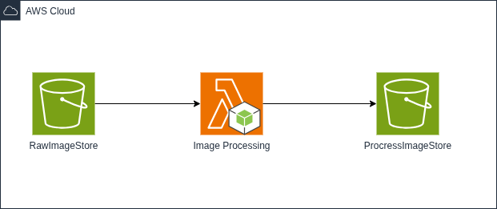

# Serverless Image Processing with S3 and Lambda

## Project Overview

This project demonstrates a serverless approach to image processing using AWS services, specifically Amazon S3 and AWS Lambda. It automates the process of adding a watermark text to images uploaded to an S3 bucket, then stores the processed images in a separate S3 bucket. The solution is scalable, cost-effective, and leverages cloud-native architecture principles.

## Project Architecture

## Key Features

- **Automatic Image Processing:** When an image is uploaded to the raw images bucket, a Lambda function is triggered automatically.
- **Watermarking:** The Lambda function adds a large watermark text to the image using the Sharp library.
- **Storage Separation:** Raw images and processed images are stored in separate S3 buckets (`rawimagestore` and `processimagestore` respectively), maintaining a clean and organized workflow.
- **Serverless and Scalable:** The solution requires no server management and scales automatically with the volume of images processed.
- **Efficient Image Manipulation:** Uses the Sharp library within a Node.js Lambda function for fast and high-quality image processing.
- **Cost-Effective:** Uses AWS’s pay-as-you-go model with minimal operational overhead.

## Components Used

- **Amazon S3:** Object storage service used to store both raw and processed images.
- **AWS Lambda:** Serverless compute service that runs the image processing code triggered by S3 events.
- **Sharp (Node.js Image Processing Library):** A fast, high-performance image manipulation library used in the Lambda function.

## How It Works

1. An image is uploaded to the designated raw images bucket (`rawimagestore`).
2. This upload triggers the Lambda function via an S3 event notification.
3. The Lambda function downloads the raw image from S3.
4. It generates an SVG overlay with the watermark text "mandalorian" in large font and semi-transparent white color.
5. The SVG is composited over the image using Sharp.
6. The processed image is then uploaded to the processed images bucket (`processimagestore`).

## Output

### Raw Image

### Processed Image

## Benefits

- **Automated Workflow:** Removes the need for manual image processing.
- **No Infrastructure Management:** Fully serverless, so no servers to provision or maintain.
- **Customizable Watermark:** The watermark text, size, color, opacity, and position can be easily customized using SVG.
- **Highly Available:** Leveraging AWS infrastructure ensures high availability and durability of stored images.

## Use Cases

- Adding branding or copyright watermarks to images in media workflows.
- Preparing images for websites or marketing campaigns with consistent watermarking.
- Automated batch processing of images for photo storage or sharing platforms.
- Any serverless pipeline requiring image manipulation without manual intervention.

## Prerequisites

- AWS Account with appropriate permissions for Lambda and S3.
- Configured S3 buckets for raw and processed images.
- Lambda function written in Node.js with Sharp included in the deployment package or layer.
- Proper IAM role permissions for Lambda to access S3.

## Deployment & Configuration

- Create two S3 buckets for raw and processed images.
- Configure S3 event notifications on the raw images bucket to trigger the Lambda function on object creation.
- Deploy the Lambda function with the image processing code and Sharp dependency.
- Assign the required IAM role permissions to Lambda.
- Upload an image to the raw images bucket and verify the processed image appears in the processed images bucket with the watermark applied.

## Future Enhancements

- Support for multiple watermark styles or text formats.
- Configurable watermark positioning via metadata or environment variables.
- Processing of various image formats and resizing.
- Integration with other AWS services like SNS for notifications or DynamoDB for logging.
- Web interface or API to upload and manage images.
